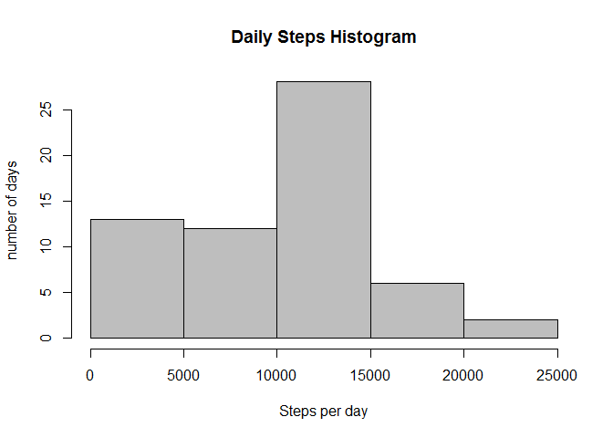
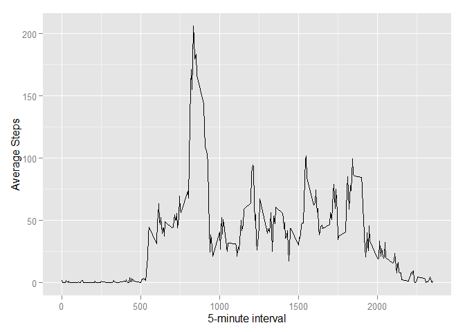
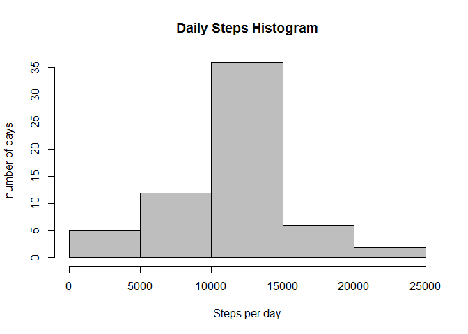
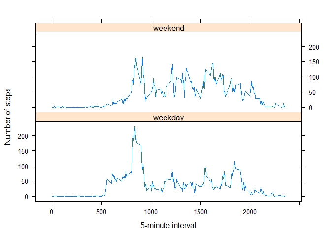

# Personal Activity Movement Analysis

This report is generated to analyse a person's physical activity movement. Two months of data from an anonymous individual collected during the months of October and November, 2012 and include the number of steps taken in 5 minute intervals each day tracked by activity monitoring device has been used for the analysis.


```r
knitr::opts_chunk$set(echo = TRUE, cache = FALSE)
```

## Loading and preprocessing the data
Activity data is avaiable in zip file. It is loaded using below code.


```r
## load required packages
library(data.table)
```

```
## Warning: package 'data.table' was built under R version 3.1.3
```

```r
library(ggplot2)
```

```
## Warning: package 'ggplot2' was built under R version 3.1.3
```

```r
library(lattice)
## set working directory
setwd("C:/Swapnil/Docs/Data Science/reproducible-research/RepData_PeerAssessment1/")

## load data into data table and check the format of fields
if(!file.exists("activity.csv")){
     unzip("activity.zip")
}
activity.df <- fread("./activity.csv", sep = ",", stringsAsFactors = FALSE, header = T)
summary(activity.df)
```

```
##      steps            date              interval     
##  Min.   :  0.00   Length:17568       Min.   :   0.0  
##  1st Qu.:  0.00   Class :character   1st Qu.: 588.8  
##  Median :  0.00   Mode  :character   Median :1177.5  
##  Mean   : 37.38                      Mean   :1177.5  
##  3rd Qu.: 12.00                      3rd Qu.:1766.2  
##  Max.   :806.00                      Max.   :2355.0  
##  NA's   :2304
```

```r
activity.df$date <- as.Date(activity.df$date)
summary(activity.df)
```

```
##      steps             date               interval     
##  Min.   :  0.00   Min.   :2012-10-01   Min.   :   0.0  
##  1st Qu.:  0.00   1st Qu.:2012-10-16   1st Qu.: 588.8  
##  Median :  0.00   Median :2012-10-31   Median :1177.5  
##  Mean   : 37.38   Mean   :2012-10-31   Mean   :1177.5  
##  3rd Qu.: 12.00   3rd Qu.:2012-11-15   3rd Qu.:1766.2  
##  Max.   :806.00   Max.   :2012-11-30   Max.   :2355.0  
##  NA's   :2304
```

## What is mean total number of steps taken per day?


```r
## calculate the total number of steps taken each day
DailySteps <- activity.df[, .(totalsteps=sum(steps, na.rm = T)), by=date]
meansteps <- round(mean(DailySteps$totalsteps, na.rm = T),2) ##mean steps per day
mediansteps <- median(DailySteps$totalsteps, na.rm = T) ##median steps per day
```


```r
## histogram of total number steps per day
hist(DailySteps$totalsteps, col="grey", xlab = "Steps per day", ylab = "number of days", main = "Daily Steps Histogram")
```

 
  
Median number of steps per day by person: **10395**

Average number of steps per day by person: **9354.23**

## What is the average daily activity pattern?

Make a time series plot (i.e. type = "l") of the 5-minute interval (x-axis) and the average number of steps taken across all days


```r
## calculate average steps per 5-minute interval across all days
avg.interval <- activity.df[, .(avgsteps=mean(steps, na.rm = T)), by=interval]
maxsteps.itv <- avg.interval[avgsteps==max(avgsteps)]$interval
```


```r
##time series plot
plt <- ggplot(avg.interval, aes(x = interval, y = avgsteps)) + 
     geom_line() + 
     xlab("5-minute interval") +
     ylab("Average Steps")
plt
```

 

**835** 5-minute interval contains the maximum number of steps averaged across all the days.

## Imputing missing values
There are a number of days/intervals where there are missing values (coded as NA). Those are imputed using below code.


```r
## calulate total number of missing values in the dataset
na.rows <- table(complete.cases(activity.df))[["FALSE"]]

## impute missing values of steps for a particular interval with average steps for the interval across all other days and create new data table with imputed information
activitydf.clean <- merge(activity.df, avg.interval, by = "interval")
activitydf.clean[is.na(steps),steps:=as.integer(avgsteps)]
summary(activitydf.clean)
```

```
##     interval          steps             date               avgsteps      
##  Min.   :   0.0   Min.   :  0.00   Min.   :2012-10-01   Min.   :  0.000  
##  1st Qu.: 588.8   1st Qu.:  0.00   1st Qu.:2012-10-16   1st Qu.:  2.486  
##  Median :1177.5   Median :  0.00   Median :2012-10-31   Median : 34.113  
##  Mean   :1177.5   Mean   : 37.33   Mean   :2012-10-31   Mean   : 37.383  
##  3rd Qu.:1766.2   3rd Qu.: 27.00   3rd Qu.:2012-11-15   3rd Qu.: 52.835  
##  Max.   :2355.0   Max.   :806.00   Max.   :2012-11-30   Max.   :206.170
```


```r
## calculate the total number of steps taken each day
DailySteps.2 <- activitydf.clean[, .(totalsteps=sum(steps, na.rm = T)), by=date]
meansteps.2 <- round(mean(DailySteps.2$totalsteps, na.rm = T),0) ##mean steps per day
mediansteps.2 <- median(DailySteps.2$totalsteps, na.rm = T) ##median steps per day
```

Histogram of the total number of steps taken each day after imputation


```r
## histogram of total number steps per day
hist(DailySteps.2$totalsteps, col="grey", xlab = "Steps per day", ylab = "number of days", main = "Daily Steps Histogram")
```

 
  
Median number of steps per day by person(after imputation): **10641**
 
Average number of steps per day by person(after imputation): **1.075\times 10^{4}**


```r
## Calculate and summarize the differance in number of steps per day due to imputation
daily.diff <- (DailySteps.2[order(date),]$totalsteps - DailySteps[order(date),]$totalsteps)
table(daily.diff)
```

```
## daily.diff
##     0 10641 
##    53     8
```

```r
Mean.diff <- meansteps.2 - meansteps
Mean.diff
```

```
## [1] 1395.77
```

```r
Median.diff <- mediansteps.2 - mediansteps
Median.diff
```

```
## [1] 246
```

There are 8 days for which information is missin for whole day. Median and mean of total number of steps per day hasn't impacted due to imputation of data.

## Are there differences in activity patterns between weekdays and weekends?

```r
##create factor variable indicating weekday of weekend
activitydf.clean[, day_type:=as.factor(ifelse(weekdays(date) %in% c("Saturday", "Sunday"), "weekend", "weekday"))]
summary(activitydf.clean)
```

```
##     interval          steps             date               avgsteps      
##  Min.   :   0.0   Min.   :  0.00   Min.   :2012-10-01   Min.   :  0.000  
##  1st Qu.: 588.8   1st Qu.:  0.00   1st Qu.:2012-10-16   1st Qu.:  2.486  
##  Median :1177.5   Median :  0.00   Median :2012-10-31   Median : 34.113  
##  Mean   :1177.5   Mean   : 37.33   Mean   :2012-10-31   Mean   : 37.383  
##  3rd Qu.:1766.2   3rd Qu.: 27.00   3rd Qu.:2012-11-15   3rd Qu.: 52.835  
##  Max.   :2355.0   Max.   :806.00   Max.   :2012-11-30   Max.   :206.170  
##     day_type    
##  weekday:12960  
##  weekend: 4608  
##                 
##                 
##                 
## 
```


```r
## calculate average steps per 5-minute interval across all weekdays or weekends
avg.interval.2 <- activitydf.clean[, .(avgsteps=mean(steps, na.rm = T)), by=.(interval, day_type)]
```

Panel plot containing a time series plot of the average number of steps taken for the 5-minute interval averaged across all weekday days or weekend days


```r
xyplot(avgsteps~interval|day_type, data = avg.interval.2, type="l", layout = c(1,2),
       xlab="5-minute interval", ylab="Number of steps", main="")
```

 

Summary of average number of steps taken across weekends and weekdays


```r
summary(avg.interval.2[day_type=="weekday", ]$avgsteps) ##for weekdays
```

```
##    Min. 1st Qu.  Median    Mean 3rd Qu.    Max. 
##   0.000   2.156  25.700  35.550  50.810 230.400
```

```r
summary(avg.interval.2[day_type=="weekend", ]$avgsteps) ##for weekends
```

```
##    Min. 1st Qu.  Median    Mean 3rd Qu.    Max. 
##   0.000   1.188  32.310  42.310  74.590 166.600
```

Median and mean of the average number of steps accross the weekends is more than across the weekdays.
